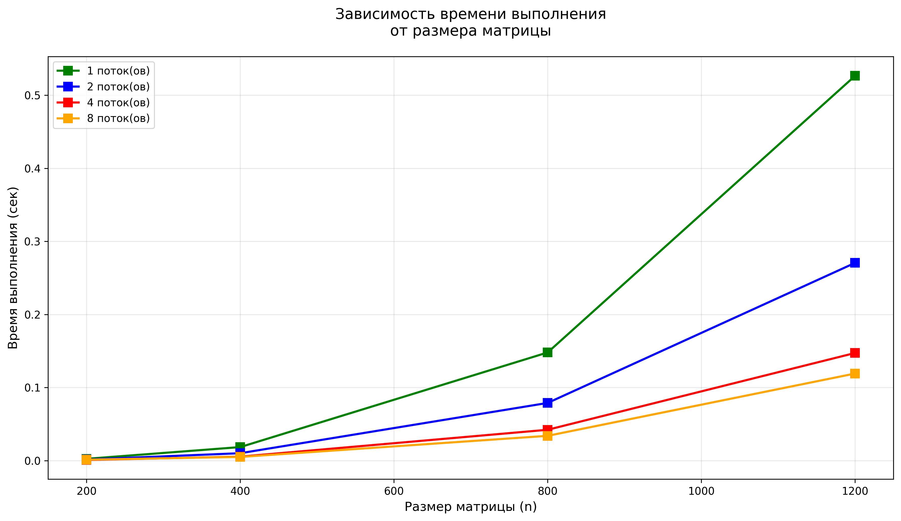
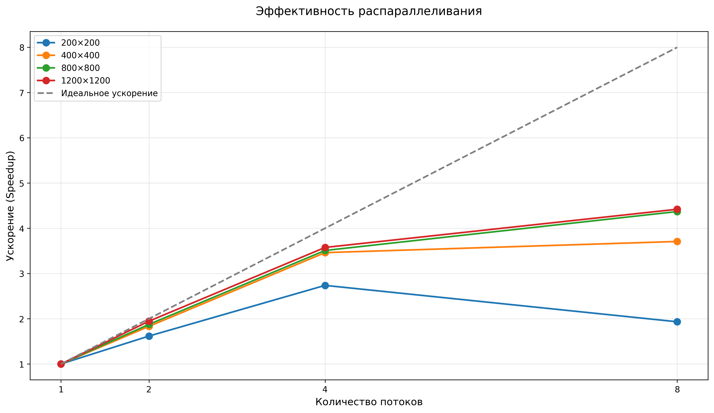
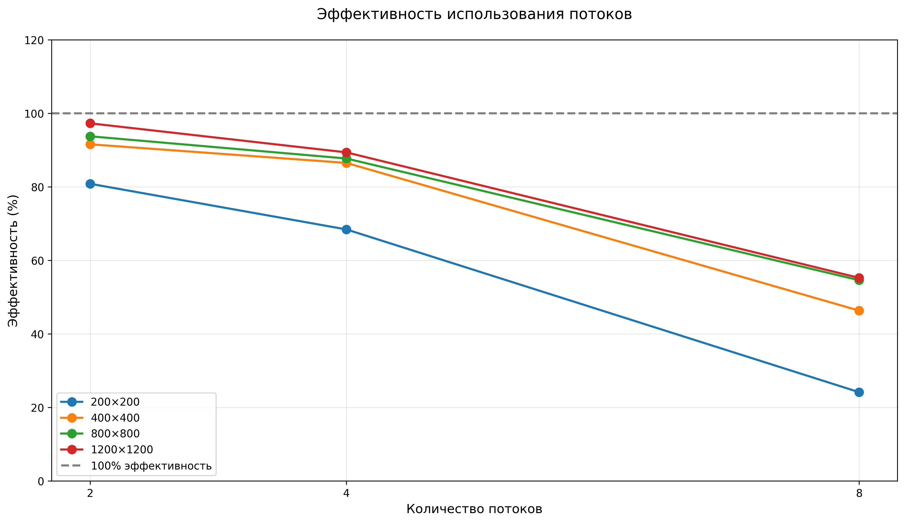
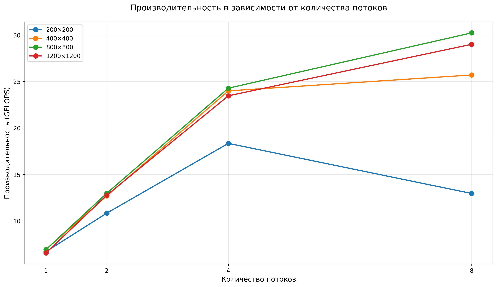

# Лабораторная работа №2
## Штенгауэр Кирилл 6313

### Описание компонентов

### `main.cpp` — OpenMP ядро

**Функционал:**
1. Читает две матрицы из файлов (`matrix_a.txt`, `matrix_b.txt`).
2. Выполняет умножение `C = A × B` с использованием OpenMP для параллельных вычислений.
3. Алгоритм оптимизирован с порядком циклов `i-k-j` для улучшения локальности кэша.
4. Реализована директива `#pragma omp parallel for collapse(2)` для параллельного выполнения внешних циклов.
5. Замеряет время выполнения через `std::chrono`.
6. Сохраняет результат в `matrix_res.txt`.
7. Выводит отчёт: размер, время (мс), количество потоков, производительность (GFLOPS).

**Компиляция:**
```bash
g++ -fopenmp -O2 main.cpp -o main.exe
```

**Запуск:**
```bash
./main.exe <num_threads> data/matrix_a.txt data/matrix_b.txt data/matrix_res.txt
```


## Бенчмарк
### `benchmark_openmp.py` — Бенчмарк OpenMP


**Функционал:**
1. Для каждого размера из `[200, 400, 800, 1200]`:
   - Генерирует тестовые матрицы
   - Запускает `main.exe` с 1, 2, 4 и 8 потоками
   - Проводит 3 замера, берёт минимальное время
2. Рассчитывает:
   - Время выполнения (сек)
   - Производительность (GFLOPS)
   - Ускорение (Speedup) относительно 1 потока
   - Эффективность распараллеливания (%)
3. Строит графики:
   - Время выполнения от размера матрицы
   - Ускорение от количества потоков
   - Эффективность от количества потоков
   - Производительность от количества потоков
4. Сохраняет результаты в `performance_results_openmp/results_openmp.csv`

**Запуск:**
```bash
python benchmark_openmp.py
```

### `performance_results_openmp/` — Результаты тестирования

Содержит:
- `results_openmp.csv` — сводная таблица результатов
- `time_vs_size_openmp.png` — график времени выполнения
- `speedup_vs_threads.png` — график ускорения
- `efficiency_vs_threads.png` — график эффективности
- `gflops_vs_threads.png` — график производительности

## Результаты бенчмарка

### Производительность OpenMP умножения матриц

| Размер | Потоки | Время (сек) | GFLOPS | Ускорение | Эффективность |
|--------|--------|-------------|--------|-----------|---------------|
| 200×200 | 1 | 0.002387 | 6.70 | 1.00 | 100.0% |
| 200×200 | 2 | 0.001476 | 10.84 | 1.62 | 80.9% |
| 200×200 | 4 | 0.000872 | 18.35 | 2.74 | 68.4% |
| 200×200 | 8 | 0.001235 | 12.96 | 1.93 | 24.2% |
| 400×400 | 1 | 0.018459 | 6.93 | 1.00 | 100.0% |
| 400×400 | 2 | 0.010076 | 12.70 | 1.83 | 91.6% |
| 400×400 | 4 | 0.005333 | 24.00 | 3.46 | 86.5% |
| 400×400 | 8 | 0.004978 | 25.71 | 3.71 | 46.4% |
| 800×800 | 1 | 0.147964 | 6.92 | 1.00 | 100.0% |
| 800×800 | 2 | 0.078896 | 12.98 | 1.88 | 93.8% |
| 800×800 | 4 | 0.042165 | 24.29 | 3.51 | 87.7% |
| 800×800 | 8 | 0.033862 | 30.24 | 4.37 | 54.6% |
| 1200×1200 | 1 | 0.526596 | 6.56 | 1.00 | 100.0% |
| 1200×1200 | 2 | 0.270592 | 12.77 | 1.95 | 97.3% |
| 1200×1200 | 4 | 0.147260 | 23.47 | 3.58 | 89.4% |
| 1200×1200 | 8 | 0.119122 | 29.01 | 4.42 | 55.3% |

*Тестирование проводилось на матрицах размером от 200×200 до 1200×1200*

### Графики производительности

#### Зависимость времени выполнения от размера матрицы



*График демонстрирует уменьшение времени выполнения при увеличении количества потоков для всех размеров матриц. Наибольший эффект от параллелизации наблюдается на больших матрицах (800×800 и 1200×1200).*

#### Ускорение от количества потоков



*Пунктирная линия показывает идеальное ускорение. Для матриц 800×800 и 1200×1200 наблюдается ускорение, близкое к линейному, при использовании до 4 потоков. Дальнейшее увеличение до 8 потоков даёт меньший прирост из-за накладных расходов на синхронизацию.*

#### Эффективность распараллеливания



*Эффективность использования потоков снижается с увеличением их количества. Наилучшая эффективность (93-97%) достигается на 2 потоках для больших матриц. При 8 потоках эффективность падает до 24-55% в зависимости от размера.*

#### Производительность от количества потоков



*Производительность растёт с увеличением количества потоков. Максимальная производительность (30.24 GFLOPS) достигнута на матрице 800×800 с 8 потоками, что в 4.4 раза выше последовательной версии (6.92 GFLOPS).*

## Выводы по работе

### Выполненные задачи

1. **Реализовано параллельное умножение матриц на C++ с OpenMP** с использованием директивы `#pragma omp parallel for collapse(2)`
2. **Разработана система бенчмаркинга** для измерения производительности на различных размерах матриц с 1, 2, 4 и 8 потоками
3. **Построены графики** ускорения, эффективности и производительности


Разработанная программа демонстрирует эффективное использование OpenMP для параллельного умножения матриц. Полученные результаты подтверждают:

- **Хорошую масштабируемость** алгоритма для матриц большого размера
- **Значительный прирост производительности** при увеличении количества потоков до 4-8
- **Важность выбора оптимального количества потоков** в зависимости от размера матрицы