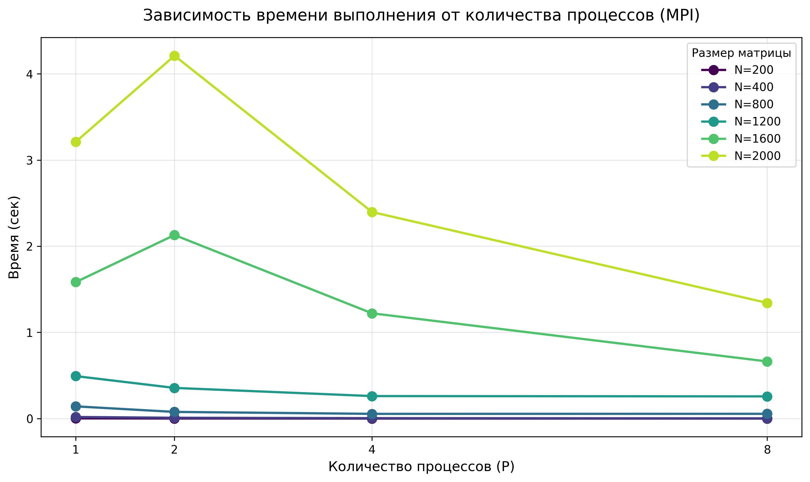
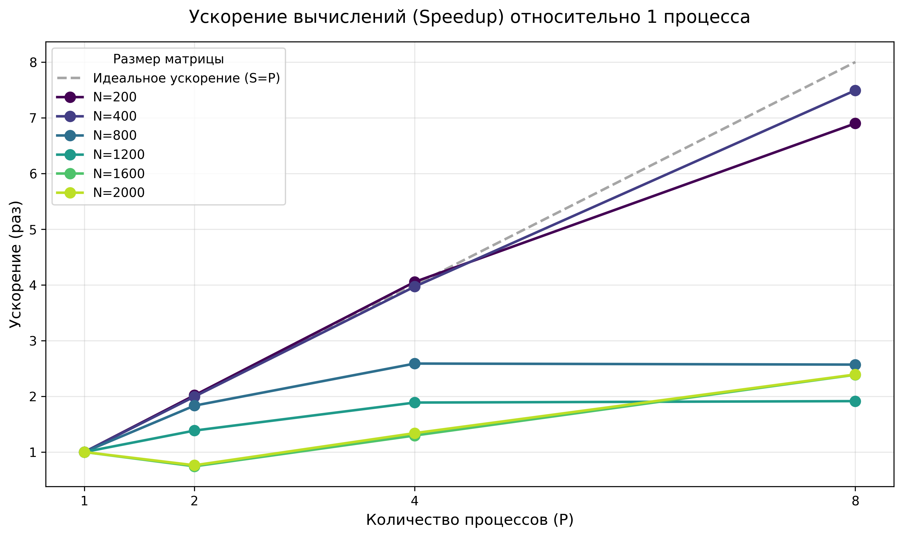
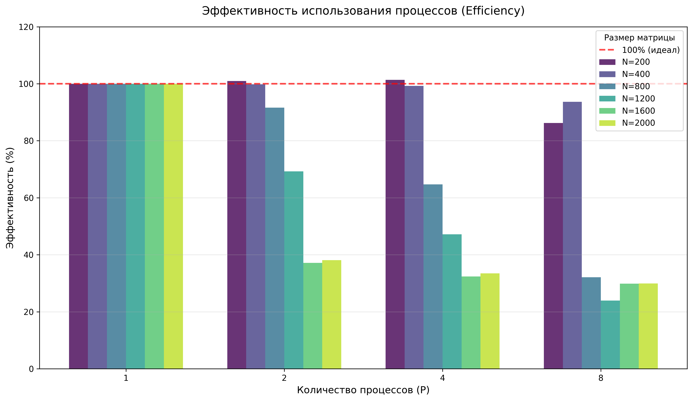
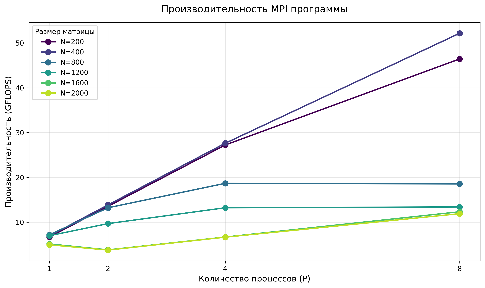
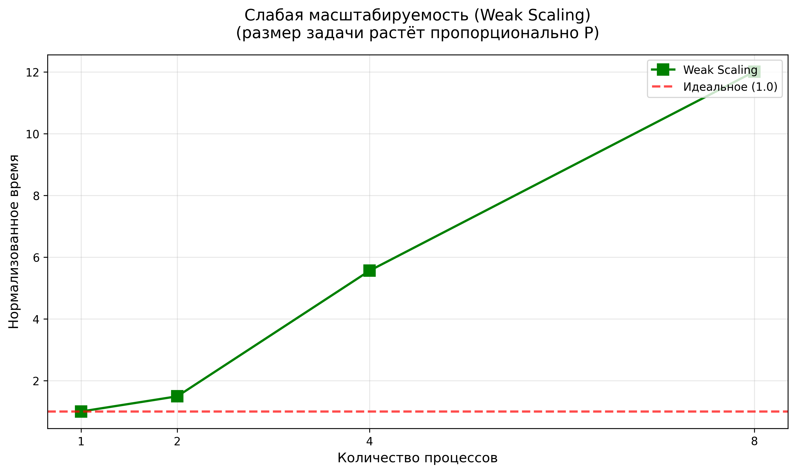

# Лабораторная работа №3
## Штенгауэр Кирилл 6313

### Исходный код
- `main_mpi.cpp` — MPI программа умножения матриц
- `benchmark_mpi.py` — скрипт автоматизации экспериментов
- `checkMultiply.py` — верификация результатов

## Параметры бенчмарка

| Параметр | Значения |
|----------|----------|
| Размер матрицы (N) | 200, 400, 800, 1200, 1600, 2000 |
| Количество процессов (P) | 1, 2, 4, 8 |
| Операций (FLOPs) | 2·N³ |
| Тип данных | double (8 байт) |

**Формулы метрик:**
- Speedup: `S = T₁ / Tₚ`
- Efficiency: `E = (S / P) × 100%`

## Результаты

### Малые матрицы (хорошая масштабируемость)

| N | P | Время (с) | GFLOPS | Speedup | Eff% |
|---|---|-----------|--------|---------|------|
| 200 | 1 | 0.0024 | 6.72 | 1.00 | 100.0 |
| 200 | 8 | 0.0003 | 46.43 | **6.90** | 86.2 |
| 400 | 1 | 0.0184 | 6.96 | 1.00 | 100.0 |
| 400 | 8 | 0.0025 | 52.15 | **7.49** | 93.7 |

Ускорение близко к линейному, эффективность >85%

### Средние матрицы (умеренная масштабируемость)

| N | P | Время (с) | GFLOPS | Speedup | Eff% |
|---|---|-----------|--------|---------|------|
| 800 | 1 | 0.1418 | 7.22 | 1.00 | 100.0 |
| 800 | 4 | 0.0548 | 18.69 | 2.59 | 64.7 |
| 800 | 8 | 0.0552 | 18.56 | 2.57 | **32.1** |
| 1200 | 1 | 0.4928 | 7.01 | 1.00 | 100.0 |
| 1200 | 8 | 0.2575 | 13.42 | 1.91 | **23.9** |

Насыщение ускорения при P≥4, падение эффективности

### Большие матрицы (проблемная масштабируемость)

| N | P | Время (с) | GFLOPS | Speedup | Eff% |
|---|---|-----------|--------|---------|------|
| 1600 | 1 | 1.5831 | 5.17 | 1.00 | 100.0 |
| 1600 | 2 | 2.1295 | 3.85 | **0.74** | 37.2 |
| 1600 | 8 | 0.6632 | 12.35 | 2.39 | 29.8 |
| 2000 | 1 | 3.2099 | 4.98 | 1.00 | 100.0 |
| 2000 | 2 | 4.2099 | 3.80 | **0.76** | 38.1 |
| 2000 | 8 | 1.3419 | 11.92 | 2.39 | 29.9 |

Отрицательное ускорение при P=2, эффективность <40%

---

## Визуализация и анализ графиков

### 1. Зависимость времени выполнения от количества процессов
 
Для малых матриц (N≤800) время монотонно уменьшается с ростом P, что свидетельствует о корректной работе параллельного алгоритма. Для больших матриц (N≥1600) наблюдается аномальный рост времени при переходе с 1 на 2 процесса, после чего кривая выравнивается. Это подтверждает гипотезу о доминировании накладных расходов на межпроцессное взаимодействие (коммуникации, синхронизация) над вычислительной частью при малом числе процессов и большом объёме пересылаемых данных.

### 2. Ускорение вычислений (Speedup)

Кривые для N=200 и N=400 близко следуют за идеальной линией, демонстрируя высокую параллельную эффективность. Начиная с N=800 графики отклоняются от идеала и выходят на плато, что указывает на насыщение ускорения. При N≥1600 ускорение не превышает 2.5× даже при 8 процессах, что характерно для коммуникационно-ограниченных задач, где закон Амдала ограничивает дальнейший прирост производительности.

### 3. Эффективность использования процессов (Efficiency)

При N≤400 эффективность остаётся выше 85% вплоть до P=8, что говорит об оптимальном балансе вычислений и коммуникаций. С ростом размера матрицы эффективность резко падает: при N=1600 и N=2000 она опускается ниже 30%. Это означает, что большая часть времени процессов тратится не на умножение, а на ожидание данных и синхронизацию, что типично для наивных MPI-реализаций матричных операций без оптимизации топологии обмена.

### 4. Производительность в GFLOPS

Максимальная производительность достигается при N=400, P=8 (~52 GFLOPS). При увеличении N свыше 400 производительность на больших размерах (N=1200–2000) стабилизируется на уровне 10–13 GFLOPS и практически не растёт с добавлением процессов. Это подтверждает, что система упирается не в вычислительную мощность ядер, а в пропускную способность шины/сети и задержки MPI-коммуникаций.

### 5. Анализ слабой масштабируемости (Weak Scaling)

В режиме слабой масштабируемости время выполнения должно оставаться постоянным, если алгоритм идеально масштабируется. На графике видно значительное отклонение от идеальной линии: при увеличении P нормализованное время растёт, что указывает на рост относительных накладных расходов. Это подтверждает, что при увеличении нагрузки на систему параллелизм не компенсирует возросший объём межпроцессного обмена.

---

## Ключевые наблюдения

### 1. Зависимость ускорения от размера задачи
- N=200:  S₈ = 6.9×  (86% eff)  - отлично
- N=400:  S₈ = 7.5×  (94% eff)  - отлично
- N=800:  S₈ = 2.6×  (32% eff)  - умеренно
- N=2000: S₈ = 2.4×  (30% eff)  - плохо

### 2. Аномалия: отрицательное ускорение
- При N≥1600 и P=2 время **увеличивается** вместо уменьшения
- Причина: накладные расходы на коммуникации > выигрыш от параллелизма

### 3. Пик производительности
- Максимальные GFLOPS достигнуты при **N=400, P=8** (52 GFLOPS)
- Дальнейший рост N не даёт прироста производительности

## Выводы

### Положительные результаты
1. Алгоритм корректно распараллелен (результаты верифицированы)
2. Для малых задач (N≤400) достигается ~линейное ускорение
3. Код масштабируется до 8 процессов без ошибок

### Ограничения
1. Эффективность падает с ростом размера матрицы
2. При N≥1600 добавление процессов может **замедлить** выполнение
3. Коммуникационная модель не оптимальна для больших задач