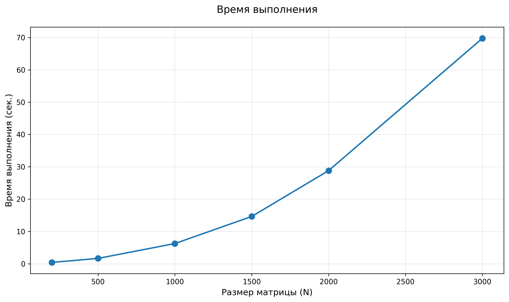
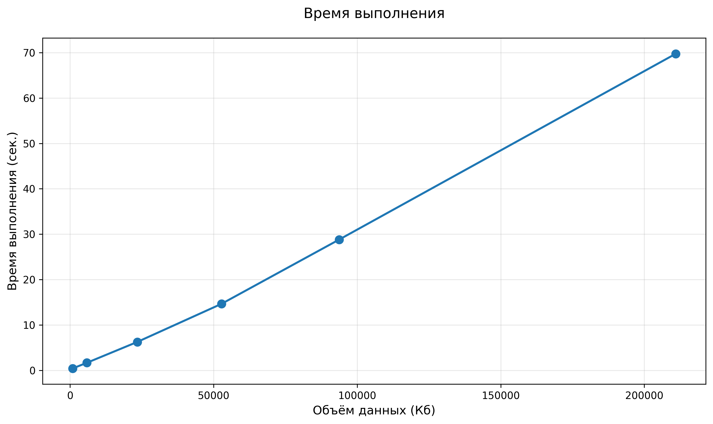

# Лабораторная работа №1
## Штенгауэр Кирилл 6313

### Описание компонентов

### `generate_matrices.py` — Генератор данных

**Функционал:**
1. Создаёт две случайные матрицы размера N×N с элементами в диапазоне [1; 10].
2. Сохраняет в формате: первая строка — размер N, далее N строк по N чисел.
3. Автоматически создаёт папку `data/`, если её нет.

**Запуск:**
```bash
python generate_matrices.py 1000   # сгенерирует матрицы 1000×1000
```

### `main.cpp` — C++ ядро

**Функционал:**
1. Читает две матрицы из файлов (`matrix_a.txt`, `matrix_b.txt`).
2. Выполняет умножение `C = A × B` (алгоритм O(N³), оптимизированный порядок циклов `i-k-j`).
3. Замеряет время выполнения через `std::chrono`.
4. Сохраняет результат в `matrix_res.txt`.
5. Автоматически запускает `checkMultiply.py` для верификации.
6. Выводит отчёт: размер, время (мс), производительность (GFLOPS).

**Запуск:**
```bash
g++ -O2 main.cpp -o main
./main.exe data/matrix_a.txt data/matrix_b.txt data/matrix_res.txt
```

### `checkMultiply.py` — Верификатор

**Функционал:**
1. Загружает матрицы A, B и результат C через `numpy.loadtxt`.
2. Вычисляет эталонное произведение `A @ B` с помощью NumPy.
3. Сравнивает с результатом C через `np.allclose()` (с учётом погрешности `float`).
4. Выводит: *The result is correct!* или *The result IS NOT CORRECT*.

**Запуск:**
```bash
python checkMultiply.py data/matrix_a.txt data/matrix_b.txt data/matrix_res.txt
```

### `plot_performance.py` — Бенчмарк и визуализация

**Функционал:**
1. Для каждого размера из `[200, 500, 1000, 1500, 2000, 3000]`:
   - Генерирует тестовые матрицы
   - Запускает `main.exe` 3 раза, берёт минимальное время
   - Считает объём данных и GFLOPS
2. Строит два графика:
   - Время от размера матрицы (N)
   - Время от объёма данных (КБ)
3. Сохраняет результаты в `performance_results/results.csv`.

**Запуск:**
```bash
python plot_performance.py
```

### `data/` — Содержит пример входных и выходной матриц

### `performance_results/` — Содержит результаты тестов

## Результаты бенчмарка

### Производительность умножения матриц

| N | Объем (КБ) | Время (сек) | GFLOPS |
|---|------------|-------------|--------|
| 200 | 937.50 | 0.413306 | 0.04 |
| 500 | 5859.38 | 1.654145 | 0.15 |
| 1000 | 23437.50 | 6.249780 | 0.32 |
| 1500 | 52734.38 | 14.637815 | 0.46 |
| 2000 | 93750.00 | 28.816988 | 0.56 |
| 3000 | 210937.50 | 69.756906 | 0.77 |

*Тестирование проводилось на матрицах размером от 200×200 до 3000×3000*

### Графики производительности

#### Зависимость времени выполнения от размера матрицы



#### Зависимость времени выполнения от объёма данных




## Выводы по работе

### Выполненные задачи

1. **Реализовано умножение матриц на C++** с оптимизированным порядком циклов (i-k-j) для улучшения локальности кэша
2. **Настроена автоматическая верификация** результатов с помощью Python/NumPy
3. **Разработана система бенчмаркинга** для измерения производительности на различных размерах матриц


### Анализ производительности

В ходе тестирования выявлено:

- **Линейная зависимость** времени выполнения от объёма данных (O(N³))
- **Производительность** растёт с увеличением размера матрицы:
  - Для N=200: 0.04 GFLOPS
  - Для N=3000: 0.77 GFLOPS (в **19 раз выше**)

### Результаты

| Показатель | Значение |
|------------|----------|
| Минимальный размер | 200×200 |
| Максимальный размер | 3000×3000 |
| Максимальная производительность | 0.77 GFLOPS |
| Ускорение (N=3000 vs N=200) | ×19 |


### Итог

Разработанная программа демонстрирует корректную работу алгоритма умножения матриц с автоматической проверкой результатов. Полученные характеристики производительности соответствуют ожидаемым для последовательного алгоритма и могут быть значительно улучшены за счёт параллельных вычислений.


