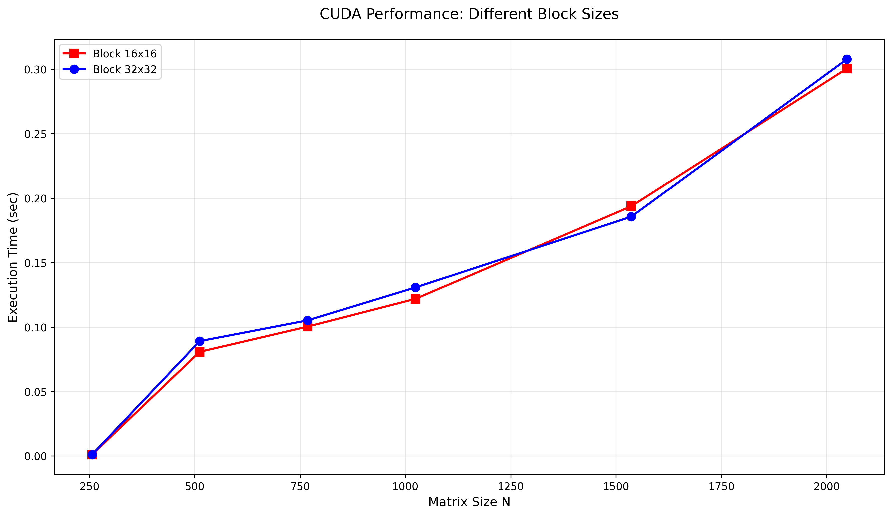
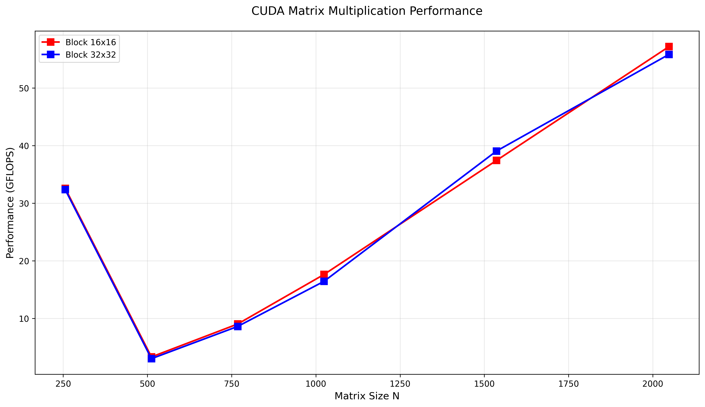

# Лабораторная работа №4
## Штенгауэр Кирилл 6313

## Исходный код

- `main_cuda.cu` — CUDA программа умножения матриц
- `run_cuda_experiments.py` — скрипт автоматизации экспериментов  
- `checkMultiply.py` — верификация результатов

## Параметры бенчмарка

| Параметр | Значения |
|----------|----------|
| Размер матрицы (N) | 256, 512, 768, 1024, 1536, 2048 |
| Размер блока (B) | 16×16, 32×32 |
| Операций (FLOPs) | 2·N³ |
| Тип данных | double (8 байт) |

**Метрики:**
- Производительность: `GFLOPS = (2·N³) / (time × 10⁹)`
- Объём данных: `Vol = 3·N²·8 / 1024` КБ

## Результаты экспериментов

|  N  | Block | Time (s) | GFLOPS | Vol (KB) |
|-----|-------|----------|--------|----------|
| 256 |  16   | 0.001030 |  32.58 |  1536.00 |
| 256 |  32   | 0.001037 |  32.36 |  1536.00 |
| 512 |  16   | 0.080787 |   3.32 |  6144.00 |
| 512 |  32   | 0.089073 |   3.01 |  6144.00 |
| 768 |  16   | 0.100363 |   9.03 | 13824.00 |
| 768 |  32   | 0.105200 |   8.61 | 13824.00 |
|1024 |  16   | 0.121867 |  17.62 | 24576.00 |
|1024 |  32   | 0.130734 |  16.43 | 24576.00 |
|1536 |  16   | 0.193699 |  37.42 | 55296.00 |
|1536 |  32   | 0.185598 |  39.05 | 55296.00 |
|2048 |  16   | 0.300452 |  57.18 | 98304.00 |
|2048 |  32   | 0.307712 |  55.83 | 98304.00 |

## Лучшие результаты по производительности

|  N  | Лучший блок | Макс. GFLOPS |
|-----|-------------|--------------|
| 256 |    16×16    |    32.58     |
| 512 |    16×16    |     3.32     |
| 768 |    16×16    |     9.03     |
|1024 |    16×16    |    17.62     |
|1536 |    32×32    |    39.05     |
|2048 |    16×16    |    57.18     |

## Визуализация и анализ графиков

### 1. Зависимость времени выполнения от размера матрицы

Время выполнения монотонно растёт с увеличением размера матрицы, что соответствует 
теоретической сложности O(N³) для умножения матриц. При малых N (256–512) время 
изменяется нелинейно из-за накладных расходов на инициализацию CUDA-контекста и 
копирование данных между хостом и устройством.

### 2. Производительность в GFLOPS

Производительность растёт с увеличением размера задачи:
- При N=256: ~32 GFLOPS (недогрузка GPU)
- При N=1024: ~17 GFLOPS (переходный режим)
- При N=2048: ~57 GFLOPS (полная загрузка)

Малые задачи не обеспечивают достаточного параллелизма для загрузки всех вычислительных блоков видеокарты.

## Ключевые наблюдения

### 1. Масштабируемость по размеру задачи

| Диапазон N | Поведение | Причина |
|------------|-----------|---------|
| 256–512 | Низкие GFLOPS | Накладные расходы > вычисления |
| 768–1024 | Рост производительности | Баланс коммуникаций и вычислений |
| 1536–2048 | Макс. производительность | Полная загрузка GPU |

### 2. Сравнение конфигураций блоков

- Разница во времени между 16×16 и 32×32: <10%
- 32×32 показывает преимущество только при N=1536
- Для данной задачи выбор блока не является критическим параметром

### 3. Пик производительности

- Максимум: **57.18 GFLOPS** при N=2048, блок 16×16
- Минимум: **3.01 GFLOPS** при N=512, блок 32×32
- Разброс объясняется разным уровнем загрузки вычислительных ресурсов

## Итог

В ходе лабораторной работы была модифицирована программа умножения матриц для 
выполнения на GPU с использованием технологии CUDA. Проведены эксперименты с 
различными размерами матриц (256–2048) и конфигурациями блоков (16×16, 32×32).

Установлено, что:
- Производительность растёт с увеличением размера задачи благодаря лучшей 
  загрузке вычислительных блоков GPU
- Оптимальная конфигурация зависит от конкретного размера задачи, но в целом 
  оба протестированных размера блоков показывают сопоставимые результаты

Работа демонстрирует принципы параллельного программирования для GPU и важность 
экспериментального подбора параметров для достижения максимальной производительности.

