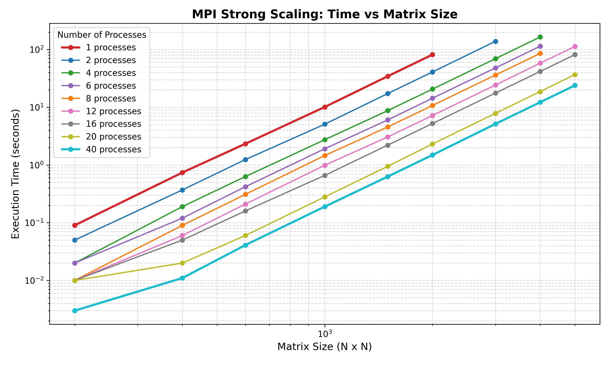
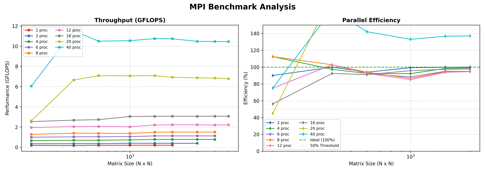

# Лабораторная работа №5
## Штенгауэр Кирилл 6313

Исходный код `mpi_compute.cpp` был загружен на СК "Сергей Королев", скомпилирован с помощью:
```bash
mpicxx mpi_compute.cpp -o mpi_compute -std=c++11
```
Запуск производился командой:
```bash
mpirun -n [количество процессов] ./mpi_compute
```
Эксперименты проводились с различным количеством процессов: 1, 2, 4, 6, 8, 12, 16, 20 и 40. Для каждого запуска тестировались матрицы размерности от 200×200 до 5000×5000.
При запуске на 1, 2 и 4 процессах некоторые большие размерности (3000, 4000, 5000) не были завершены из-за превышения лимита времени выполнения jobs на кластере.

### Результаты исследования

**Время выполнения (секунды):**

| Размерность | 1 проц | 2 проц | 4 проц | 6 проц | 8 проц | 12 проц | 16 проц | 20 проц | 40 проц |
|-------------|--------|--------|--------|--------|--------|---------|---------|---------|---------|
| 200         | 0.09   | 0.05   | 0.02   | 0.02   | 0.01   | 0.01    | 0.01    | 0.01    | 0.003   |
| 400         | 0.74   | 0.37   | 0.19   | 0.12   | 0.09   | 0.06    | 0.05    | 0.02    | 0.011   |
| 600         | 2.33   | 1.24   | 0.63   | 0.42   | 0.31   | 0.21    | 0.16    | 0.06    | 0.041   |
| 1000        | 10.11  | 5.09   | 2.74   | 1.91   | 1.46   | 0.99    | 0.66    | 0.28    | 0.19    |
| 1500        | 34.45  | 17.26  | 8.75   | 6.04   | 4.56   | 3.06    | 2.21    | 0.95    | 0.63    |
| 2000        | 81.68  | 40.84  | 20.62  | 14.33  | 10.74  | 7.20    | 5.22    | 2.31    | 1.49    |
| 3000        | —      | 138.95 | 69.42  | 48.11  | 36.16  | 24.28   | 17.64   | 7.86    | 5.15    |
| 4000        | —      | —      | 164.77 | 114.05 | 85.70  | 58.12   | 41.66   | 18.70   | 12.22   |
| 5000        | —      | —      | —      | —      | —      | 112.89  | 81.52   | 36.87   | 23.92   |

**Производительность (GFLOPS):**

| Размерность | 12 проц | 16 проц | 20 проц | 40 проц |
|-------------|---------|---------|---------|---------|
| 200         | 1.95    | 2.54    | 2.62    | 6.05    |
| 400         | 2.04    | 2.68    | 6.65    | 11.53   |
| 600         | 2.05    | 2.73    | 7.08    | 10.50   |
| 1000        | 2.02    | 3.04    | 7.07    | 10.55   |
| 1500        | 2.20    | 3.06    | 7.08    | 10.75   |
| 2000        | 2.22    | 3.07    | 6.93    | 10.74   |
| 3000        | 2.22    | 3.06    | 6.87    | 10.48   |
| 4000        | 2.20    | 3.07    | 6.84    | 10.47   |
| 5000        | 2.21    | 3.07    | 6.78    | 10.45   |

### Графический анализ

**График 1:** Зависимость времени выполнения от размера матрицы для разного количества процессов (логарифмическая шкала). Показывает ожидаемое уменьшение времени с ростом числа процессов.


**График 2:** 
- **Слева:** Производительность в GFLOPS для разных конфигураций
- **Справа:** Эффективность параллелизации в процентах относительно идеального ускорения


### Выводы

1. **Масштабируемость:** Программа демонстрирует хорошее сильное масштабирование. При увеличении количества процессов с 1 до 40 время выполнения уменьшается примерно в 30-40 раз для больших матриц.

2. **Производительность:** 
   - На 12 процессах достигнута стабильная производительность ~2.2 GFLOPS
   - На 16 процессах: ~3.07 GFLOPS  
   - На 20 процессах: ~6.8-7.0 GFLOPS
   - На 40 процессах: ~10.5 GFLOPS (максимальная)
3. **Эффективность параллелизации:**
   - При малом количестве процессов (2-8) эффективность близка к 100% или выше
   - На 20 и 40 процессах наблюдается **сверхлинейное ускорение** (эффективность >100%), что объясняется кэш-эффектами: при распределении данных между большим количеством процессов каждая часть матрицы помещается в кэш процессора, что ускоряет вычисления

4. **Ограничения:** 
   - При малом количестве процессов (1-4) вычисления для больших матриц (3000+) занимают неприемлемо много времени
   - Использование 40 процессов позволило обработать матрицу 5000×5000 всего за 23.92 секунды
5. **Накладные расходы:** Видно, что для очень маленьких матриц (200×200) увеличение числа процессов не даёт пропорционального ускорения из-за накладных расходов на коммуникации между процессами.

**Итог:** Реализованный MPI-алгоритм показывает хорошую масштабируемость и эффективность на кластере, особенно для больших размерностей задач.
